<h1 align = "center">Relation-Shape Convolutional Neural Network for Point Cloud Analysis</h1>
<p align = "center">
    <a href="https://yochengliu.github.io/" style="font-size: 23px">Yongcheng Liu</a> &emsp;
    <a href="http://www.nlpr.ia.ac.cn/fanbin/" style="font-size: 23px">Bin Fan</a> &emsp;
    <a href="https://scholar.google.com/citations?user=0ggsACEAAAAJ&hl=zh-CN" style="font-size: 23px">Shiming Xiang</a>  &emsp;
    <a href="http://people.ucas.ac.cn/~0005314" style="font-size: 23px">Chunhong Pan</a>
</p>
<p align = "center">
    <a href="http://cvpr2019.thecvf.com/" style="font-size: 23px"><strong>CVPR 2019</strong></a> &emsp;
    <font color="#FF4500" size="5"><strong>Oral & Best paper finalist</strong></font>
</p>
<br>

<div align="center">
    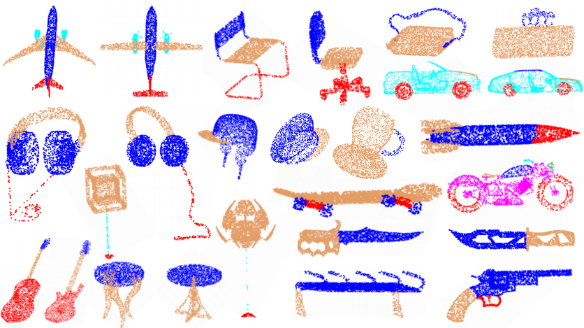
</div>
<p align = 'center'>
    <small>Segmentation examples on ShapeNet part benchmark. Although the part shapes implied in irregular points are extremely diverse and they may be very confusing to recognize, our RS-CNN can also segment them out with decent accuracy.</small>
</p>

<h1 align = "center">Abstract</h1> 

Point cloud analysis is very challenging, as the shape implied in irregular points is difficult to capture. In this paper, we propose RS-CNN, namely, Relation-Shape Convolutional Neural Network, which extends regular grid CNN to irregular configuration for point cloud analysis. ___The key to RS-CNN is learning from relation___, _i.e._, the geometric topology constraint among points. Specifically, the convolutional weight for local point set is forced to ___learn a high-level relation expression from predefined geometric priors___, between a sampled point from this point set and the others. In this way, an inductive local representation with ___explicit reasoning about the spatial layout of points___ can be obtained, which leads to much shape awareness and robustness. With this convolution as a basic operator, RS-CNN, a hierarchical architecture can be developed to achieve contextual shape-aware learning for point cloud analysis. Extensive experiments on challenging benchmarks across three tasks verify RS-CNN achieves the state of the arts.

<h1 align = "center">Motivation</h1> 

<div align="center">
    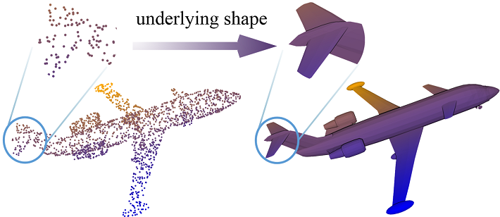
</div>
<p align = 'center'>
    <small>Left part: 3D Point cloud. Right part: Underlying shape formed by this point cloud.</small>
</p>

- The geometric relation among points is an explicit expression about the spatial layout of points, further discriminatively reflecting the underlying shape.

- CNN has demonstrated its powerful visual abstraction capability for 2D images that are in the format of a regular grid.

- Can we extend 2D grid CNN to 3D irregular configuration for point cloud analysis, by learning expressive geometric relation encoding for discriminative shape awareness?

<h1 align = "center">RS-Conv: Relation-Shape Convolution</h1>

[rsconv]: ./images/rsconv.jpg
![rsconv]
<p align = 'center'>
<small> Overview of our relation-shape convolution (RS-Conv). </small>
</p>

In this paper, we develop a hierarchical CNN-like architecture, _i.e._ RS-CNN. RS-CNN is equipped with a novel learn-from-relation convolution operator called relation-shape convolution (RS-Conv). As illustrated in the figure, the key to RS-CNN is learning from relation.

To be specific:

- The convolutional weight 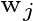 for 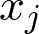 is converted to 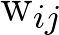, which learns a high-level mapping 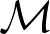, _i.e._, 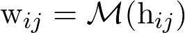, on predefined geometric relation vector 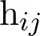.

- In this way, the inductive convolutional representation 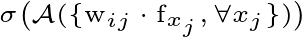 can expressively reason the spatial layout of points, resulting in discriminative shape awareness.

- As in image CNN, further channel-raising mapping is conducted for a more powerful shape-aware representation.

<h1 align = "center">Revisiting 2D Grid Convolution</h1>

<div align="center">
    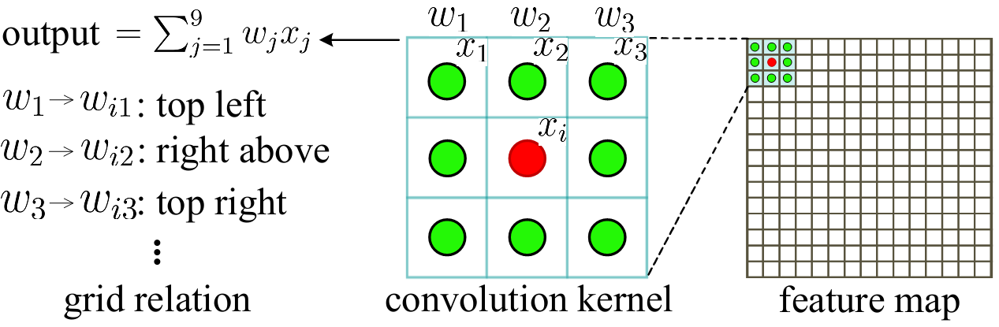
</div>
<p align = 'center'>
<small> Illustration of 2D grid convolution with a kernel of 3 x 3. </small>
</p>

- The convolutional weight 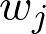 for  always implies a fixed positional relation between 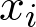 and its neighbor  in the regular grid. That is,  is actually constrained to encode one kind of regular grid relation in the learning process.

- Therefore, our RS-Conv with relation learning is more general and can be applied to model 2D grid spatial relationship.

<h1 align = "center">Experiment</h1>

### Shape Classification on ModelNet40 Benchmark

<div align="center">
    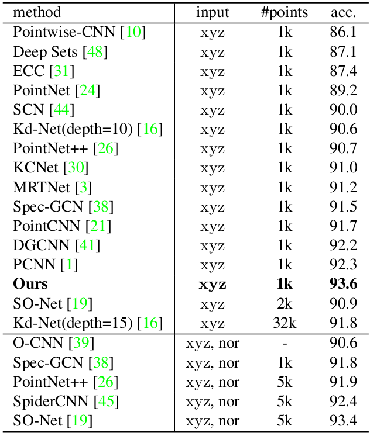
</div>
<p align = 'center'>
<small> Shape classification results (%) (nor: normal). </small>
</p>

- Our RS-CNN outperforms the state-of-the-art point cloud-based methods with only 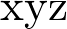 as the input features. 

### Normal Estimation

<div align="center">
    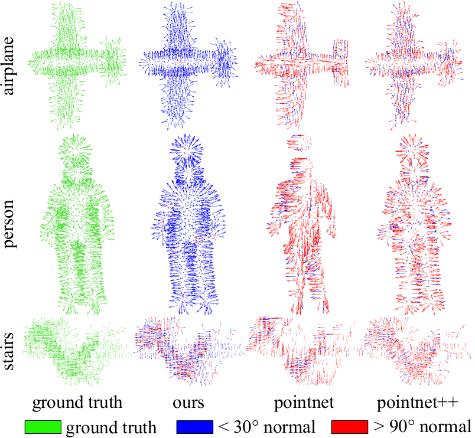
</div>
<p align = 'center'>
<small> Normal estimation examples. For clearness, we only show predictions with angle less than 30 degree in blue, and angle greater than 90 degree in red between the ground truth normals. </small>
</p>

### Geometric Relation Definition

<div align="center">
    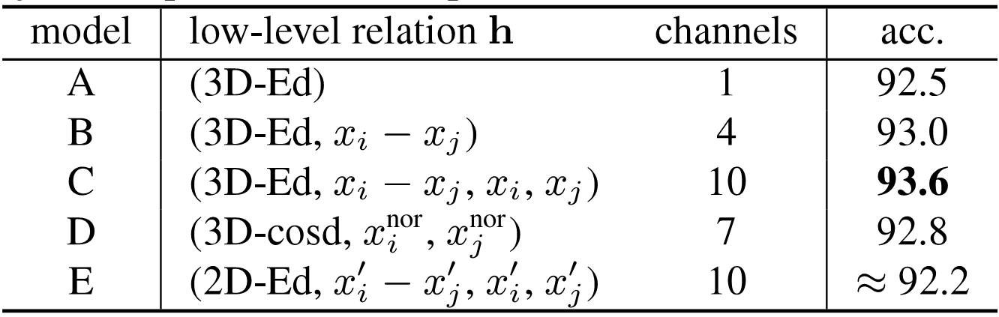
</div>
<p align = 'center'>
<small> The results (%) of five intuitive low-level relation. Model A applies only 3D Euclidean distance; Model B adds the coordinates difference to model A; Model C adds the coordinates of two points to model B; Model D utilizes the normals of two points and their cosine distance; Model E projects 3D points onto a 2D plane of XY, XZ and YZ. </small>
</p>

- The low-level relation vector can be defined flexibly. 

- Using only 3D Euclidean distance as relation can result in an accuracy of 92.5%.

- Even learning from the relation in 2D projections of points, a decent performance of 92.2% can also be achieved. 

### Robustness to sampling density

<div align="center">
    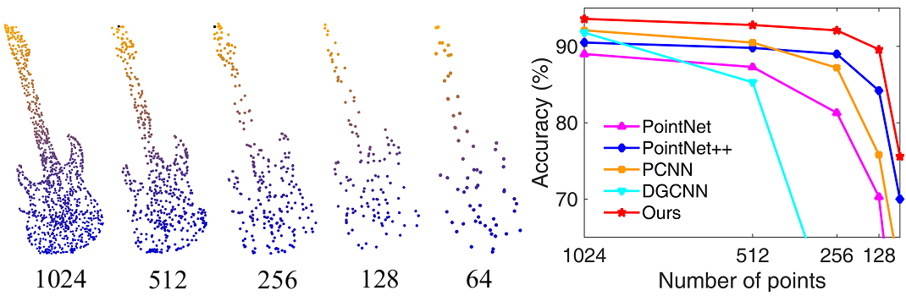
</div>
<p align = 'center'>
<small> Left part: Point cloud with random point dropout. Right part: Test results of using sparser points as the input to a model trained with 1024 points. </small>
</p>

### Robustness to point permutation and rigid transformation (%)

<div align="center">
    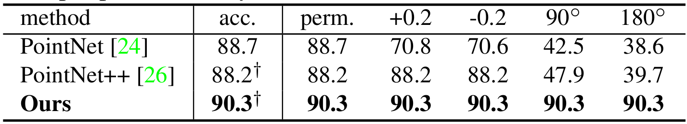
</div>
<p align = 'center'>
<small> All the models are trained without related data augmentations, e.g., translation or rotation, to avoid confusion. During testing, we perform random permutation (perm.) of points, add a small translation of 0.2 and rotate the input point cloud by 90 degree and 180 degree. </small>
</p>

<h1 align = "center">Visualization and Complexity</h1>

### Visualization

<div align="center">
    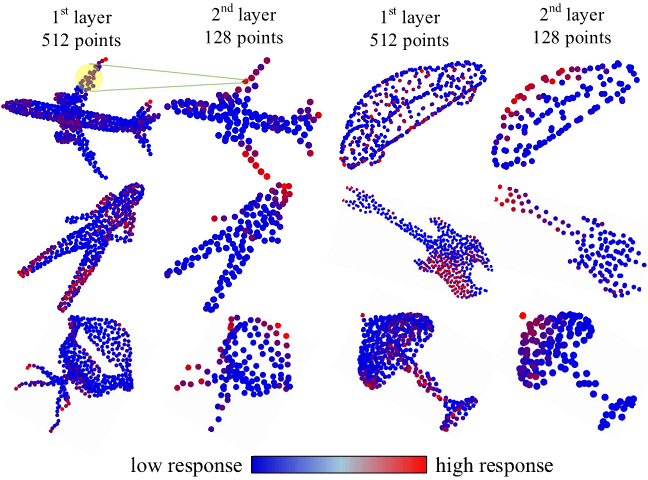
</div>
<p align = 'center'>
<small> Visualization of the shape features learned by the first two layers of RS-CNN. </small>
</p>

- The features learned by the first layer mostly respond to edges, corners and arcs, while the ones in the second layer capture more semantical shape parts like airfoils and heads.

- As image CNN, our RS-CNN learns 3D shape semantics from point cloud in a local-to-global manner.

### Complexity

<div align="center">
    
</div>
<p align = 'center'>
<small> Complexity of RS-CNN in point cloud classification. </small>
</p>

<h1 align = "center">Publication</h1>

Yongcheng Liu, Bin Fan, Shiming Xiang and Chunhong Pan, "Relation-Shape Convolutional Neural Network for Point Cloud Analysis", in IEEE Conference on Computer Vision and Pattern Recognition (CVPR), 2019. [[arXiv](https://arxiv.org/abs/1904.07601)] [[CVF](http://openaccess.thecvf.com/content_CVPR_2019/papers/Liu_Relation-Shape_Convolutional_Neural_Network_for_Point_Cloud_Analysis_CVPR_2019_paper.pdf)]

```
        @inproceedings{liu2019rscnn,   
            author = {Yongcheng Liu and    
                            Bin Fan and    
                      Shiming Xiang and   
                           Chunhong Pan},   
            title = {Relation-Shape Convolutional Neural Network for Point Cloud Analysis},   
            booktitle = {IEEE Conference on Computer Vision and Pattern Recognition (CVPR)},    
            pages = {8895--8904},  
            year = {2019}   
        }   
```
